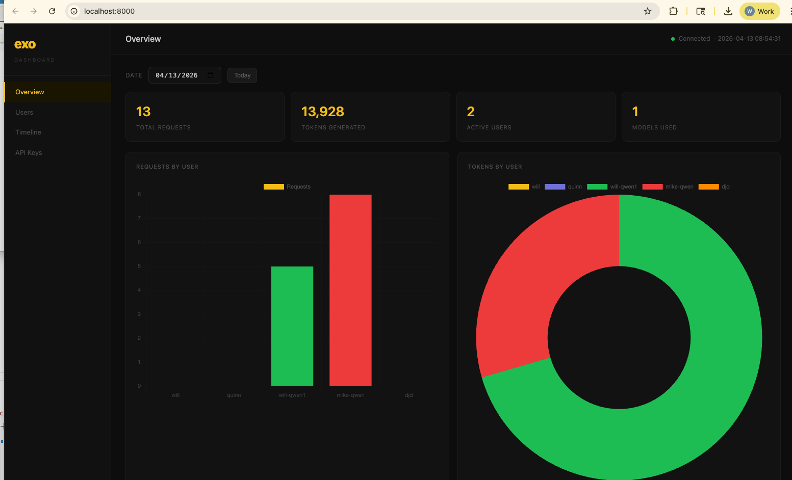

# EXO Dashboard

> A self-hosted usage tracking dashboard for your local EXO AI cluster.



If you're running [EXO](https://github.com/exo-explore/exo) on Apple Silicon and sharing access with others, you have no visibility into who's calling your models or how much they're using. This fixes that.

## What this does

EXO gives you the raw inference power. This dashboard sits in front of it and gives you:

- **API key management** — generate keys for teammates, revoke them anytime
- **Per-user tracking** — see exactly who sent how many requests and used how many tokens
- **Date-based overview** — pick any date and see that day's requests, tokens, active users, and models used
- **Usage timeline** — daily charts, hourly heatmaps, 7/14/30 day views
- **OpenAI-compatible proxy** — one line change in your existing code, nothing else breaks
- **CSV export** — pull all usage data for billing or reporting
- **SQLite storage** — all data persists across restarts, no external database needed

## Hardware context

Built for a 2× Mac Studio M3 Ultra cluster (512GB RAM each, 1TB combined) running frontier open-weight models via EXO over Thunderbolt direct connect.

| | This setup | Equivalent NVIDIA |
|---|---|---|
| Hardware | 2× Mac Studio M3 Ultra | ~8× H100 |
| Cost | ~$24,000 | ~$780,000 |
| Models | Kimi K2.5, DeepSeek V3.1, Qwen3.5 | Same |

**Network setup:** Two Mac Studios connected via Thunderbolt cable with static IPs (`10.0.0.1` / `10.0.0.2`), achieving sub-1ms latency vs 100–170ms over WiFi. EXO runs in Pipeline + TCP/IP mode.

**Performance:** ~25 tok/s on Qwen3.5-397B-A17B-8bit across two machines.

## Setup

```bash
git clone https://github.com/yourname/exo-dashboard
cd exo-dashboard
pip3 install -r requirements.txt
cd server
python3 main.py
```

Open `http://localhost:8000`

## Configuration

Edit `server/config.py`:

```python
EXO_BASE_URL = "http://YOUR_MAC_STUDIO_IP:52415"
PORT = 8000
```

## Usage

Point your existing OpenAI-compatible code at the dashboard instead of EXO directly:

```python
# Before (direct EXO)
api_base = "http://192.168.x.x:52415/v1"
api_key  = "local"

# After (through dashboard)
api_base = "http://192.168.x.x:8000/v1"
api_key  = "your_key_here"

# Pick a model:
model = "mlx-community/Kimi-K2.5"
model = "mlx-community/DeepSeek-V3.1-4bit"
model = "mlx-community/Qwen3.5-397B-A17B-8bit"
```

Nothing else changes. The dashboard forwards every request to EXO and logs it.

## Generating API keys

Open `http://localhost:8000` → **API Keys** → type a name → select a model → **Generate Key**

The dashboard shows the full snippet ready to copy and send to your user.

## Project structure

```
exo-dashboard/
├── frontend/
│   ├── js/main.js          # All frontend logic and charts
│   ├── style/base.css      # Global styles
│   ├── style/sidebar.css   # Sidebar
│   └── index.html          # Entry point
└── server/
    ├── routers/
    │   ├── proxy.py        # Request forwarding + usage logging
    │   ├── stats.py        # Stats API
    │   ├── users.py        # User/key management
    │   └── export.py       # CSV export
    ├── config.py           # All config in one place
    ├── database.py         # SQLite — swap to Postgres by editing this file only
    └── main.py             # FastAPI entry point
```

## Requirements

- 2× Mac Studio M3 Ultra (or any EXO-compatible cluster)
- Thunderbolt cable for direct node-to-node connection
- EXO running in Pipeline + TCP/IP mode
- Python 3.9+

## Why not just use EXO's built-in dashboard?

EXO's dashboard shows you what's running. This shows you **who's using it and how much**. If you're sharing your cluster with a team, you need both.

## Stack

- Backend: FastAPI + SQLite
- Frontend: vanilla JS + Chart.js
- Proxy: httpx async streaming
- No npm, no build step, no Docker
